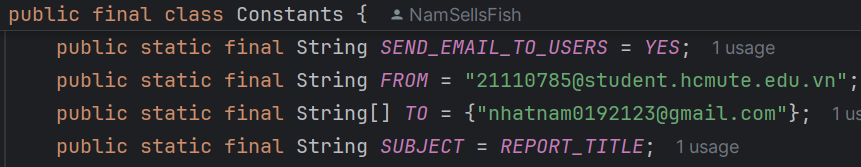

## Test Automation Project Selenium Java with TestNG building by Nam

🔆 **SOME KEY FEATURES IN FRAMEWORK**

1. Run the parallel test case
2. Extent Report
3. Send Mail after the run test (Report information and HTML file attachment)
4. Record video and Screenshot test case
5. Read data test from Excel file (xlsx, csv, json,...)
6. Base function in the package: utils, helpers
7. Main Keyword: WebUI (call common function)
8. Sample test all function in WebUI keyword
9. Run Selenium Grid (remote)
10. Javadoc for this source

### ✳️ **SYSTEM REQUIREMENTS**

- Install JDK (recommend JDK >= 11)
- Install Chrome Browser, Edge Browser, Firefox Browser
- Run well on the **Windows** platform
- Use **IntelliJ IDEA** is the best choice (easy change the JDK version)

### ✳️ **HOW TO USE**

**1. Run parallel the test case**

- Run test case in suite XML (**src/test/resources**)
- Run test case from Maven pom.xml file
  (**mvn clean test**)

  

**2. Extent Report**

- Insert "OtherTestInfo" as sample or None:


- The base value read from Enums (src/test/java/org/nam/common/enums)
- Setup on TestListener and BaseTest


**3. Send Mail after the run test**

- Config **email info** in Contanst file
  (**src/test/java/org/nam/common/Constants.java**)
- SEND_EMAIL_TO_USERS=**YES** is enable send mail
  


**4. Record video and Screenshot**

- Config **config info** in Contanst file
  (**src/test/java/org/nam/common/Constants.java**)
- screenshot_passed_steps=yes or no
- screenshot_failed_steps=yes or no
- screenshot_skipped_steps=yes or no
- screenshot_all_steps=yes or no

  

  

**5. Read data test from Excel file**

- Create method with annotaion **DataProvider** on *
  *src/test/java/org/nam/common/managers/DataProviderManager.java**
- Read excel with Map and Hashtable

**6. Base function in the package**

- **_src/test/java/org/nam/common/helpers_**
- **_src/test/java/org/nam/common/utils_**

**7. Main Keyword: WebUI**

- WebUI class is main keyword in Project. It contains common functions
- How to use: WebUI.function_name
- Example: WebUI.setWindowSize(1024, 768), WebUI.screenshotElement(By by, String elementName),...

**8. Call function to using sample**

- All in one package: src/test/java/org/nam/testcases

```
+ ClientTest
+ SignInTest
```

**9. Use Selenium Grid**

### Download and Install

a. Download Docker: https://www.selenium.dev/downloads/

(tải bản Latest stable version)

**selenium-server-4.22.0.jar** (updated 24/06/2024)

b. Execute this docker compose yml file in the project directory,
use `docker compose -f docker-compose-v3-full-grid.yml up -d`

c. Config **Deploy Target Info** in Contanst file
(**src/test/java/org/nam/common/Constants.java**)


d. Navigate to the Selenium Grid console at http://localhost:4444/grid/console to observe the grid status and test
execution.

e. To stop the execution, hit Ctrl+C, and then `docker compose -f docker-compose-v3-full-grid.yml down`

**10. Javadoc for this source**
